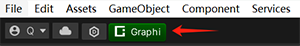
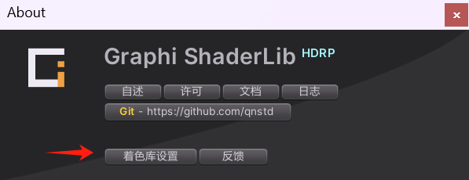
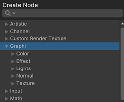

# Graphi Rendering HDRP 文档

>
## 目录结构

> Documentation（文档）
 
> Editor（编辑器）

> Runtime（运行时）

> CHANGELOG.md （日志）

> LICENSE.md （许可）

> README.md （自述）

> package.json（配置）

## 部署 
> 点击 Unity 窗体左上角带有 ***Graphi*** 标签的按钮，

> 

> 此时会弹出 ***Project Settings*** 检视板中的 ***Graphi Rendering HDRP*** 页签。在页签中，点击 ***Set*** 按钮，使着色库与当前工程进行适配。

> 

> 执行完毕后，即可使用着色库进行图形相关的操作了。

## 操作项
着色库所有操作项都被包含在 Unity 的菜单栏中。

> **Hierarchy**

>> 层次结构中需要创建的游戏对象，都绑定在 GameObject 菜单项中。例如：GameObject/Volume/OccDisplay Volume（创建遮挡显示体积组件）。在 GameObject 支持创建的游戏可通过 ***HierarchyUtils.cs*** 脚本查看。

> **Project**

>> Project工程面板中可创建的资源对象都绑定在 Assets/Create 菜单项中。例如：Assets/Create/Shader/HLSL（创建 HLSL 着色文件）。所有资源对象创建的脚本可在 ***Editor/Shader*** 目录下找到。

> **Shader**
>> 1. 在材质中，可动态设置选择的着色器都在 ***Graphi*** 路径下。
>> 
>> 2. 在 ***ShaderGraph*** 操作面板中，着色库也提供了特定的 ***ShaderGraph Node*** 节点。所有自定义节点也都在 ***Graphi*** 页签下。
>> 
>> 3. 后处理（PostProcess）、全屏处理（FullScreen）、天空盒（Sky）等着色器全部绑定在体积（Volume）组件内。

> **Component**

>> 着色库提供了一些组件，其中部分组件是需要配合同名着色器一起使用（例如：Runtime/Components/Shield.cs 组件需要与 Graphi/Fx/Shield 着色器一起使用）。这些组件可在 ***Runtime/Components*** 目录下找到。

## 其他
##### **[关于 CN.Graphi](https://github.com/qnstd)**