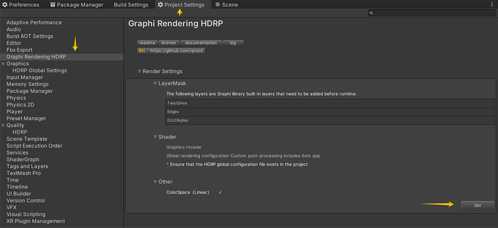
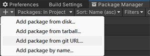

# Graphi Rendering HDRP 文档

>
## 目录结构

> Documentation（文档）
 
> Editor（编辑器）

> Runtime（运行时）

> CHANGELOG.md （日志）

> LICENSE.md （许可）

> README.md （自述）

> package.json（配置）

## 部署 
> 点击 Unity 窗体左上角带有 ***Graphi*** 标签的按钮，在弹开的对话框中，再次点击 ***着色库设置*** 按钮。

> 

> 

> 此时会弹出 Project Settings 检视板中的 Graphi 页签。在页签中，先点击 ***编译*** 按钮对着色库进行编译。编译完毕后，再点击 ***一键设置*** 按钮，将着色库与当前工程进行适配。

> 

> 以上操作全部完毕后，就可以使用 Graphi Rendering 着色库了。

## 配置项
着色库提供了一些配置项，用于对全局操作的管理。在工程设置检视板中的 Graphi 页签内。

> 

点击按钮可快速定位到配置文件目标位置。

## 操作项
着色库所有操作项都被包含在 Unity 的菜单栏（Assets、GameObject、Window等）中。

> Assets/Graphi : 用于在 ***Project*** 检视板中创建相关的资源

> GameObject/Graphi : 用于在 ***Hierarchy*** 列表中创建游戏对象

> Edit/Graphi : 资源编辑工具

> Shader : 着色器
>> 1. 在材质中，可动态设置选择的着色器都在 Graphi 路径下。
>> 
>> 2. 在 ShaderGraph 操作面板中，着色库也提供了特定的 ShaderGraph Node 节点。所有自定义节点也都在 Graphi 页签下。
>> 
>> 3. 后处理（PostProcess）及全屏处理（FullScreen）的着色器全部绑定在体积（Volume）组件内。

## 其他
##### **[关于 CN.Graphi](https://github.com/qnstd)**