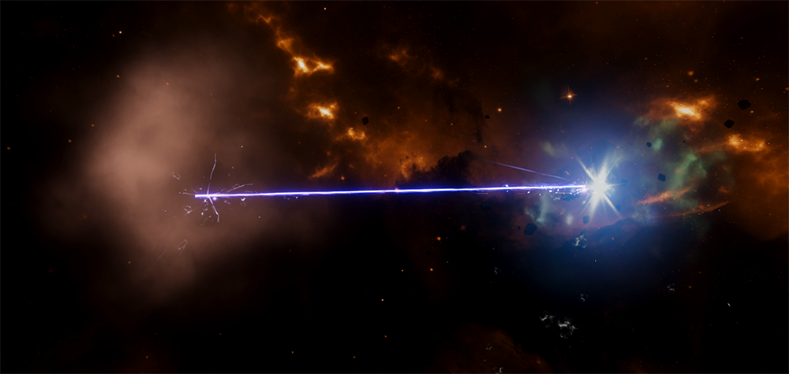
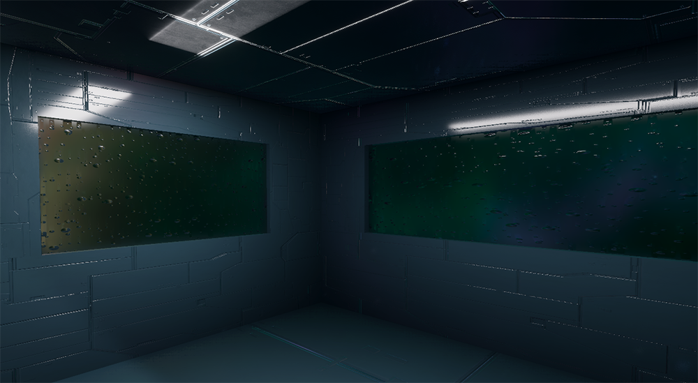

# Graphi Rendering HDRP
#

## 说明
> 基于 Unity 高清渲染管线的图形着色库， 不支持 Builtin、URP 渲染管线。

> 着色库以 Unity 2022.3 为基础开发，建议使用 **Unity 2022.3.21f1c1** 及以上版本。

> 着色库内包含了多种渲染类型。例如：半透明、自定义光照、体积（全屏、后处理）等。

#

## 教程
详细教程及相关操作说明请查看 ***[帮助文档](https://github.com/qnstd/RenderingHDRP/blob/master/Documentation/graphi_rendering_hdrp.md)***

#

## 渲染示例

>***粒子***
>

>

>***光照***
>

>***宇宙***
>
>
>
>
>
